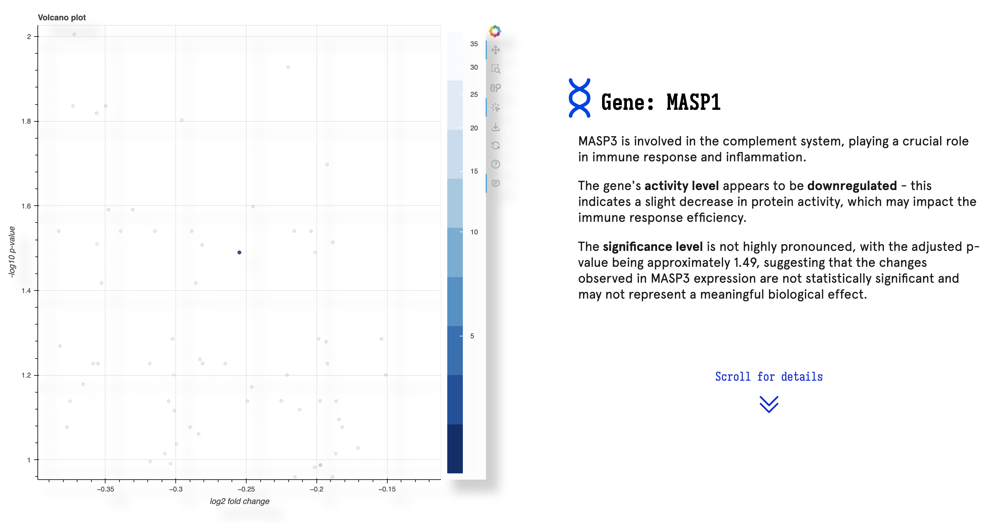
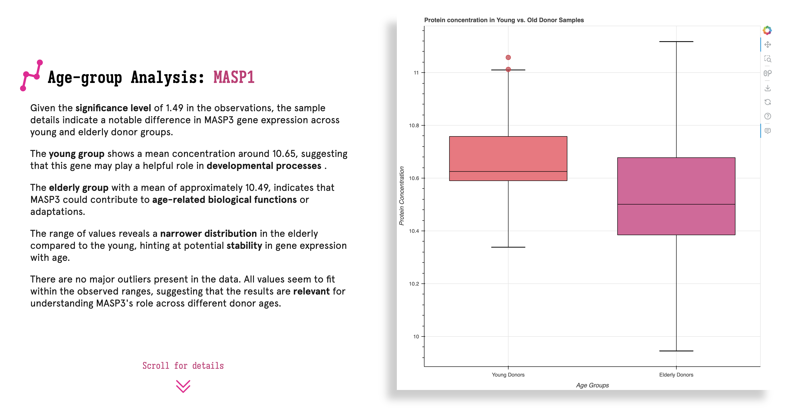
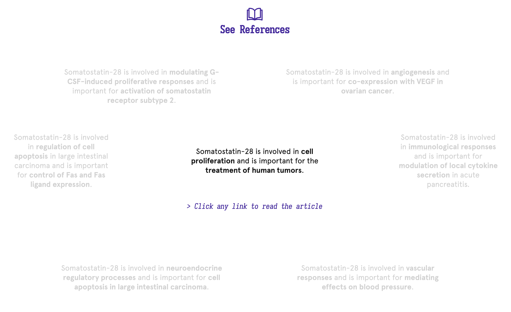

# 🧬 Gene Knowledge Base – Web Application

## 📖 Overview

This project consists in the prototype of a **full-stack web service** aimed towards analyzing **gene activity levels** (and the significance of their changes) across different age groups. Through the employment of **customizable data samples** and **interactive visualization tools**, we offer a scalable solution that facilitates the validation of experimental conclusions, backed by external, public gene knowledge.

## 🚀 Features
- **Interactive plot visualization**
  - Used a _volcano plot_ to visualize the significance level of gene regulation in relation with donor age.
  - Further observed age-related changes in the value-ranges of protein concentration, using _box plots_.

- Extracted & parsed public information from the **PubMed database** on the purpose and implications of gene regulation, using **REST API requests**.
- Summarized and concluded analytical results with the help of **LLM processing** and **OpenAI API** calls, using **self-defined prompts**.
- Included the option to **import other statistical datasets** (_.csv_ files) in order to assess their relevance through chosen **parametric tests**.
- **Cleaned the provided data** and handled edge cases for bad field content.

## 🧰 Tech Stack
| Layer       | Technologies                                       |
|-------------|----------------------------------------------------|
| Frontend    | _HTML, CSS, JS_                                    |
| Backend     | _Python, Flask, SQLite_                            |
| Visualization | _Bokeh_                                            |
| Data        | _Gene datasets, custom samples, PubMed references_ |

## 🖥️ Getting Started

### Installation
```bash
# Clone the repo
git clone https://github.com/alexandrutrifu/Gene-Knowledge-Base

# Navigate to project directory
cd Gene-Knowledge-Base

# Set up virtual environment (optional)
python3 -m venv venv
source venv/bin/activate  # or venv\Scripts\activate on Windows

# Install dependencies
pip3 install -r requirements.txt

# Run Flask server
python3 run.py
```

### Environment Setup
Update your system environment variables to contain the following:`OPENAI_API_KEY=your_openai_key_here`

**OR** manually pass your OpenAI key string to the OpenAI constructor call in `ai_interaction.py`.

### After running the server
Visit [http://127.0.0.1:5000](http://127.0.0.1:5000) in your browser.

## 🧑‍💻 Implementation

### 0. Project Structure

The project follows the file-tree structure of a standard Flask-based application:

```
gene-knowledge/
├── app/               # Core backend logic, routes, and app initialization
├── database/          # Database schema & sample data
│
├── static/            # Static frontend assets (CSS, fonts, images, JS)
│   ├── css/           # Custom stylesheets
│   ├── fonts/         # Web fonts used in the UI
│   ├── images/        # Icons & logos
│   └── js/            # Frontend JavaScript logic
│
├── templates/         # HTML templates rendered by Flask (Jinja2)
│
├── package.json       # Node.js dependencies and scripts
├── package-lock.json  # Exact dependency tree for reproducible installs
├── README.md          # Project documentation (you're reading it!)
├── requirements.txt   # Python package dependencies
└── run.py             # Entry point to launch the Flask app
```

### 0.1. Python Modules


The `app/` directory contains the following .py modules:

- `ai_interaction.py`
  - Handles all communication with the OpenAI API. It defines prompts and provides functions to either stream or return a full static response based on the user’s request.
- `data_interaction.py`
  - Handles all logic related to loading, cleaning, and extracting gene data from the SQLite database, and integrates with the AI module to enrich data with PubMed reference summaries.
- `dataframes.py`
  - Acts as a shared memory module for storing and accessing key dataframes and reference information across different parts of the app.
- `donor_plot.py`
  - Generates a custom Bokeh box plot to visualize protein concentration differences between young and elderly donor samples for a given gene.
- `gene_requests.py`
  - Fetches literature references related to a specific gene using the MyGene.info API. These references are later used by the AI module to summarize PubMed findings.
- `routes.py`
  - Defines all Flask web routes for the application, handling everything from home page rendering to dynamic gene analysis using AI and visualizations.
- `volcano_plot.py`
  - Generates an interactive volcano plot using Bokeh to visualize differential gene expression — highlighting log fold changes and statistical significance.

**_Note:_** In the spirit of developing an **SPA** (Single-Page Application), we decided to design the web routes such that only the root would render an actual HTML template. Therefore, the other routes are simply used to simulate data retrieval and to trigger backend workflows.

This aspect is subject to change as the application grows.

### 1. Application Logic

The application is built around **three** main zones of interest:
1) **Gene selector** (includes the results of the chosen parametric test)
2) **Age-group & donor sample analysis**
3) **Article references & citations**

### 1.1. Gene Selector

The first section of the web page is centered around the service’s main element – a _volcano plot_ which renders the differential expression of genes across various age groups. Each point on the plot represents a gene, with its position determined by log(fold-change) and an adjusted p-value which determines statistical significance - this enables the identification of strongly regulated genes.



Based on the gene marker selected by the user, the server sends a request to the **OpenAI API**, retrieving a summary of the selected gene’s role and relevance. This includes an interpretation of the gene’s behaviour under the current experimental conditions.

### 1.2. Donor Sample Analysis

This section focuses on exploring **protein concentration levels** for the selected gene, analyzed across two age groups: **young and elderly donors**. Upon selecting a gene, the backend uses the `donor_plot.py` module to generate a custom _box plot_, which allows the user to visually assess concentration trends and variance between the two groups.



Using **LLM processing**, our service provides an accurate mapping between the genes' concentration range and the biological behaviours they might influence across donors.

Moreover, this plotting technique highlights possible outliers in the data sample, providing an additional layer of biological insight to the previous findings.

### 1.3. Article Reference Section

The final section of the application focuses on enhancing the scientific context of the data by retrieving relevant literature references from trusted public sources. Once a gene is selected, the backend initiates a workflow via the `gene_requests.py` module, which interacts with the **MyGene.info API** to fetch PubMed articles associated with the gene’s function and regulation.



Using another LLM prompt, the application selects **7 most relevant articles**, which are then summarized into a short conclusion and made accessible to the user.

## 🔜 Scalability & Possible Improvements

**1) Changes to `routes.py`**:
- As stated earlier, route methods could be updated in order to render actual HTML templates, while the resources they currently retrieve could be accessed through secondary helper functions.

**2) Complete Reference Visualization & Filtering**:
- The user should have the option to access all available gene references, which can be filtered by influenced behaviours or other related genes.

**3) Search Function for the Volcano Plot**:
- An UX improvement through which the user could select their desired gene by an ID input field, instead of manually searching for the corresponding plot marker.

**4) Matching Import Function for Donor Samples**:
- An additional import field to modify the donor samples based on which the box plots are generated.

**5) Public Dataset Accessibility**:
- By imposing a universal datasheet format, the application could parse and handle (other) public databases, without the need of a local file upload. These external databases could be refactored towards the desired format (and field composition) with the help of LLM processing.

